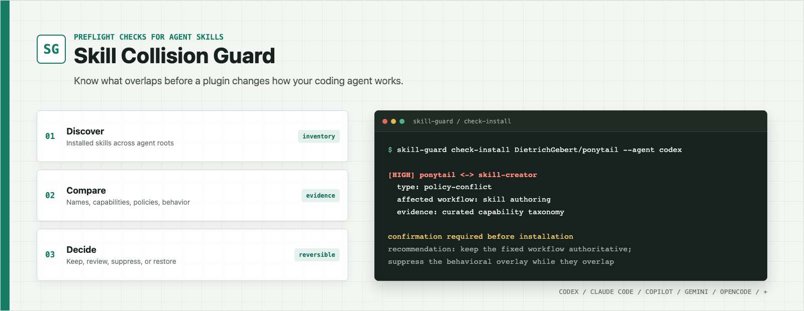

<p align="center">
  
</p>

<h1 align="center">Skill Collision Guard</h1>

<p align="center">
  Preflight checks for coding-agent skills and plugins.
  Detect overlap before installation, compare the instructions, and resolve conflicts without deleting anything.
</p>

<p align="center">
  <a href="LICENSE"></a>
  <a href="package.json"></a>
  <a href="package.json"></a>
  <a href="README.zh-CN.md"></a>
</p>

Skill Collision Guard inspects coding-agent skills before they are installed or invoked. It catches exact name shadowing, differently named skills with the same capability, opposing policies, broad behavioral overlays, and workflows that are useful together. When two skills should not run at the same time, one can be suppressed for a session and restored later without moving or editing its files.

> [!IMPORTANT]
> A clean report is not proof of compatibility. The capability taxonomy is intentionally curated and finite. Everything except exact same-name shadowing is evidence for semantic review, not an automatic verdict.

## Why this exists

Coding agents can discover instructions from user directories, project directories, plugins, extensions, and system bundles. Two individually useful skills can silently compete once both are visible to the same agent.

| Problem | What the guard does |
|---|---|
| Two skills expose the same name | Reports deterministic name shadowing and recommends keeping one |
| Different names describe the same job | Maps aliases and descriptions to capability families such as TDD, debugging, review, and skill authoring |
| A global coding mode changes a fixed workflow | Reports behavioral interference and keeps the fixed workflow authoritative |
| Instructions disagree inside shared scope | Surfaces the opposing policies and pauses installation for a decision |
| Two review passes serve different purposes | Marks them complementary instead of treating every similarity as a conflict |
| A conflict only matters for this session | Suppresses one skill cooperatively, then restores it without touching the installation |

## How it works

```text
candidate skill or plugin
          |
          v
discover installed skills for the selected agent
          |
          v
compare names + capabilities + policies + behavioral scope
          |
          v
allow | review | suppress for session | keep one
```

The detector combines deterministic checks with a curated capability taxonomy and lexical/policy heuristics. Reports include both paths, the relationship type, confidence, evidence source, affected workflows, opposing policies, and a recommended next action.

## Detection signals

The comparison pipeline evaluates higher-confidence rules first. Explicit separation and paired actions short-circuit generic similarity before the conflict branches, which prevents obvious counterparts from becoming false positives.

| Signal | Implementation | Decision effect |
|---|---|---|
| Exact name shadowing | `normalizeName` lowercases names, replaces punctuation with hyphens, and compares the normalized values exactly | `name-shadow` / `critical`; this is the only automatic verdict |
| Lexical similarity | Jaccard similarity over name character bigrams and description tokens: `nameSimilarity * 0.45 + descriptionSimilarity * 0.55` | Feeds `probable-duplicate` and `overlap`; body similarity is retained as human evidence but does not affect the routing score |
| Capability families | Curated name/description patterns and facets for TDD, debugging, skill authoring, code review, minimal implementation/YAGNI, codebase architecture, and skill routing | Detects synonymous names, different roles inside one capability, and known cross-skill relationships |
| Policy conflicts | Five opposing regex groups: dependency choice, response detail, read/write behavior, approval requirements, and test policy | Produces `policy-conflict` / `high` only when the skills also have enough shared scope |
| Behavioral interference | `behavior.js` identifies a global write policy, records whether it is persistent, and checks whether it can alter a capability marked as a fixed workflow | Produces `behavioral-interference` / `medium`, or `policy-conflict` / `high` when an opposing policy is also present |
| Paired actions and explicit separation | `save/restore`, `freeze/unfreeze`, `install/uninstall`, `enable/disable`, `start/stop`, and `encode/decode`; descriptions may also declare `separate`, `different`, or `distinct from` another skill | Short-circuits to `distinct` with no warning, even if generic lexical similarity exists |
| Curated complementary facets | Capability-specific facet rules, currently including complexity-only review versus correctness review | Produces `complementary` / `info`; keep both and run them as separate passes |

This layered model is why a differently named pair such as `tdd` and `test-driven-development` can be found without relying on name similarity alone, while `save-state` and `restore-state` are not incorrectly reported as duplicates.

## Quick start

Node.js 18 or newer is required. There are no third-party runtime dependencies.

```bash
git clone https://github.com/Three-Liu/skill-collision-guard.git
cd skill-collision-guard
npm link
```

Inventory the skills visible to Codex:

```bash
skill-guard scan --agent codex
```

Check a local folder, GitHub URL, `owner/repo`, or local marketplace plugin before installation:

```bash
skill-guard check-install \
  https://github.com/example/agent-plugin/tree/main/skills/example \
  --agent codex \
  --session "$SESSION_ID"
```

`check-install` exits with status `2` when a critical/high conflict or medium behavioral interference needs a decision. After an explicit decision to coexist, `SKILL_GUARD_ALLOW_CONFLICTS=1` can be scoped to one installation command. Do not set it globally.

## ClawHub

The folder [`skills/skill-collision-guard`](skills/skill-collision-guard) is a self-contained ClawHub bundle. Its frontmatter declares the `node`/`git` runtime, a narrow CLI tool allowlist, optional state-directory variables, and explicit-only invocation. The instructions disclose bounded local reads, rejection of out-of-root symlinks, the temporary shallow-clone child process, session-state writes, and cleanup behavior. `.clawhubignore` leaves host-specific routing metadata out of the portable release.

Before publishing, use Node.js 22 or newer for the current official `clawhub` CLI, authenticate, synchronize the generated runtime, and preview the exact release. The published skill runtime itself still supports Node.js 18 or newer.

```bash
npm install --global clawhub
clawhub --help
clawhub login

npm run sync:skill-bundle
npm run check

clawhub skill publish ./skills/skill-collision-guard \
  --version 0.1.1 \
  --changelog "Harden candidate boundaries and ClawHub metadata." \
  --categories agents,security,development \
  --topics coding-agents,skill-management,conflict-detection \
  --dry-run
```

Review the dry-run output, then repeat without `--dry-run` to publish. Use `clawhub sync --all --dry-run` instead when releasing several skill folders as a catalog. Do not invent a `clawhub.json` manifest: the current registry centers each bundle on `SKILL.md`.

After publication, users install the owner-qualified release with:

```bash
clawhub install @<owner>/skill-collision-guard
```

ClawHub creates `.clawhub/origin.json` and its workspace lock data on the installing machine; neither file is authored in this repository. Every submitted artifact is audited for metadata/content coherence and receives SkillSpector, VirusTotal, and ClawScan-backed risk analysis. Publishing a skill on ClawHub releases that skill bundle under MIT-0; the wider repository remains under its [MIT license](LICENSE).

Official references: [ClawHub CLI](https://docs.openclaw.ai/clawhub/cli), [publishing](https://docs.openclaw.ai/clawhub/publishing), [skill format](https://docs.openclaw.ai/clawhub/skill-format), and [security audits](https://docs.openclaw.ai/clawhub/security-audits).

## Commands

```bash
# Cross-agent or host-scoped inventory
skill-guard scan [--agent codex] [--json]

# Installation preflight
skill-guard check-install <path|github-url|owner/repo|plugin@marketplace> \
  [--agent codex] [--session ID] [--json]

# Direct semantic comparison
skill-guard compare <skill-or-plugin> <skill-or-plugin> [--json]

# Reversible session state
skill-guard suppress <name-or-path>... --session ID [--json]
skill-guard status --session ID [--json]
skill-guard restore [name-or-path]... --session ID [--json]
```

Use `--agent <host>` to inspect only roots visible to that host. Codex scope includes Codex-specific roots and portable `.agents/skills`. Omit `--agent` only for an intentional cross-agent inventory; multiple host names can be comma-separated.

## Relationship model

| Relationship | Meaning | Default action |
|---|---|---|
| `name-shadow` | Same normalized name | Keep one |
| `capability-collision` | Different names, same capability | Read both instructions and keep one |
| `capability-conflict` | Same capability, incompatible roles or behavior | Choose the behavior needed for the task |
| `behavioral-interference` | A global write policy can alter a fixed workflow | Keep the fixed workflow authoritative; suppress the overlay while they overlap |
| `policy-conflict` | Overlapping scopes contain opposing instructions | Pause and choose one policy |
| `capability-overlap` | Related capability facets overlap | Clarify trigger boundaries |
| `complementary` | Separate passes provide distinct value | Keep both and run them separately |
| `probable-duplicate` | Instructions and goals substantially overlap | Prefer the narrower or better-maintained skill |
| `overlap` | Both may trigger but can coexist | Make their descriptions and scopes more explicit |

## Session suppression

Suppression is an instruction-level session overlay. It never deletes, renames, or edits the installed skill.

```bash
skill-guard suppress code-review --session "$SESSION_ID"
skill-guard status --session "$SESSION_ID"
skill-guard restore code-review --session "$SESSION_ID"
```

Lifecycle-enabled hosts can use the same state through prompt commands:

```text
/skill-guard suppress code-review
/skill-guard restore code-review
```

`SessionEnd` clears session state. On hosts without lifecycle hooks, suppression remains cooperative: the agent must consult the state before selecting skills.

## Host support

The project keeps one analyzer and uses thin adapters for each host. Directory discovery is explicit so prompt hooks never crawl an entire home directory.

| Host | Integration |
|---|---|
| Codex | Plugin manifest plus `SessionStart`, `UserPromptSubmit`, `PreToolUse`, and `SessionEnd` hooks |
| Claude Code | Plugin manifest using the shared hook implementation |
| GitHub Copilot CLI | Plugin manifest and prompt/install hooks |
| Gemini CLI | `GEMINI.md` instruction adapter; no incompatible lifecycle schema |
| OpenCode | Server plugin that registers the skill and injects installed-collision summaries |
| Qoder | Plugin manifest, rule, and hook template |
| Cursor, Windsurf, Cline | Always-on rule adapters with cooperative CLI checks |
| Kiro, Grok, Swival, OpenClaw | Skill discovery and standard `SKILL.md` workflow |

See [Agent portability](docs/agent-portability.md) for every project, user, extension, and plugin-cache root.

## Project layout

```text
skill-collision-guard/
|-- bin/                         CLI entry point
|-- src/                         discovery, parsing, analysis, reports, state
|-- hooks/                       lifecycle adapters
|-- skills/skill-collision-guard bundled Agent Skill
|   |-- bin/ and src/            generated standalone runtime for ClawHub
|-- docs/                        portability notes
|-- scripts/                     release bundle synchronization
|-- tests/                       Node test suite
|-- CHANGELOG.md                 semver release history
|-- .codex-plugin/               Codex manifest
|-- .claude-plugin/              Claude Code manifest
`-- .github/ and other adapters  additional host integrations
```

## Limitations

- Capability aliases are curated, so unknown synonyms can require manual comparison.
- Similarity scores are signals, not proof that two instruction sets are interchangeable.
- Remote candidates are inspected through a temporary shallow clone; download or parse failures are reported as incomplete checks, never as conflict-free results.
- Hook-based suppression is cooperative instruction state, not an operating-system access control.
- Prompt-only hosts cannot guarantee interception of every native UI installation.

## Development

```bash
npm run sync:skill-bundle
npm test
npm run check
npm pack --dry-run
```

The test suite covers discovery boundaries, candidate resolution, alias classification, policy conflicts, report output, hooks, manifests, reversible session state, and drift between the main runtime and the ClawHub bundle.

## License

[MIT](LICENSE) © 2026 Skill Collision Guard contributors.
